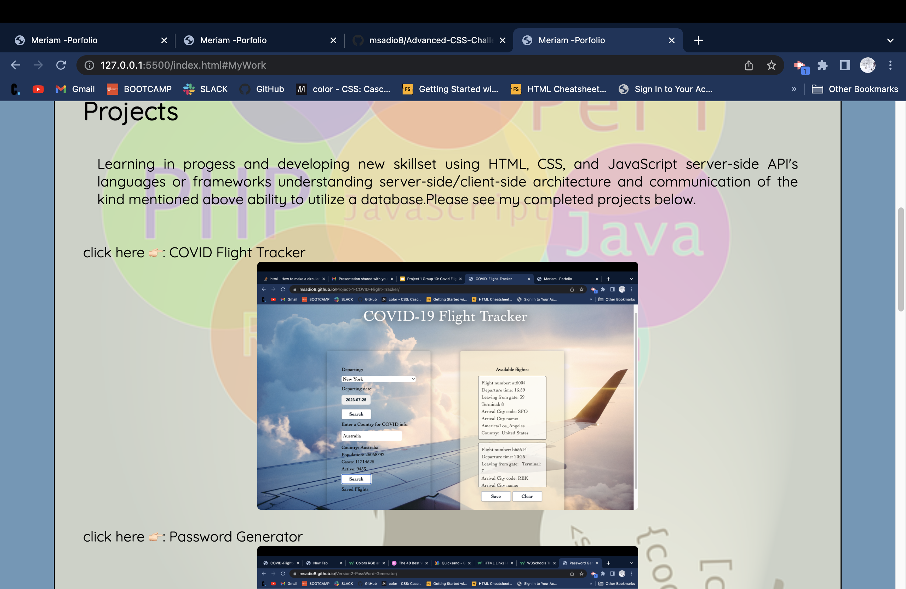
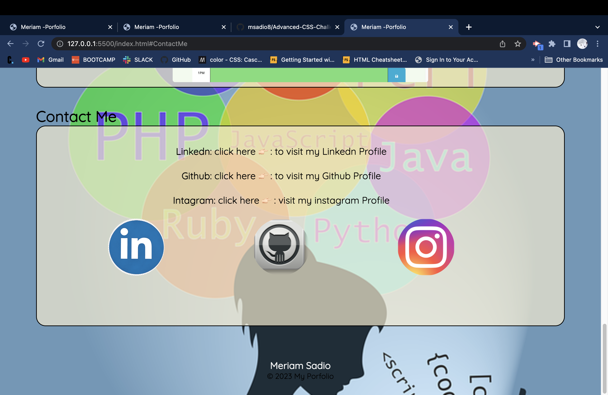

# Advanced-CSS-Challenge-Professional-Portfolio

This week Challenge is to create a web application from the scratch
we are required to build our porfolio page .

# Installation

Use VS code tocreate my page for this challenge create repo in github then cloned to my computer deploy in chrome browser
i have used pixaby for the images i used .
i have used cooolers site for my color pallete inspiration

# screenshot & link to deployed application

# Author & Avknlowledgement

i would like to thank all TA's & my Tutor who supported me to complete this challenge

# Credits

n/a

# License

Public

## Test & Deployment

[click here 👉🏻] : (Professional Portfolio)
